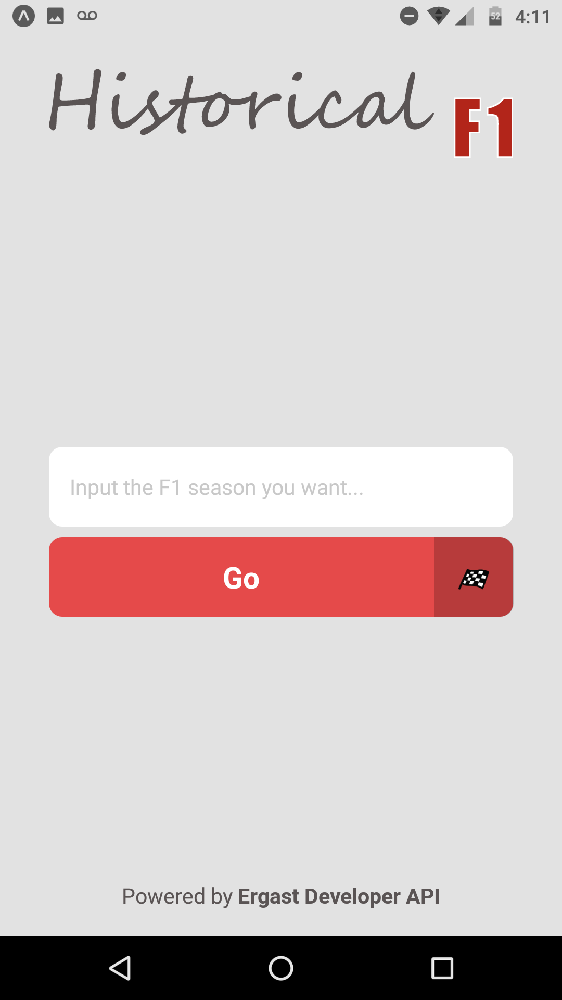
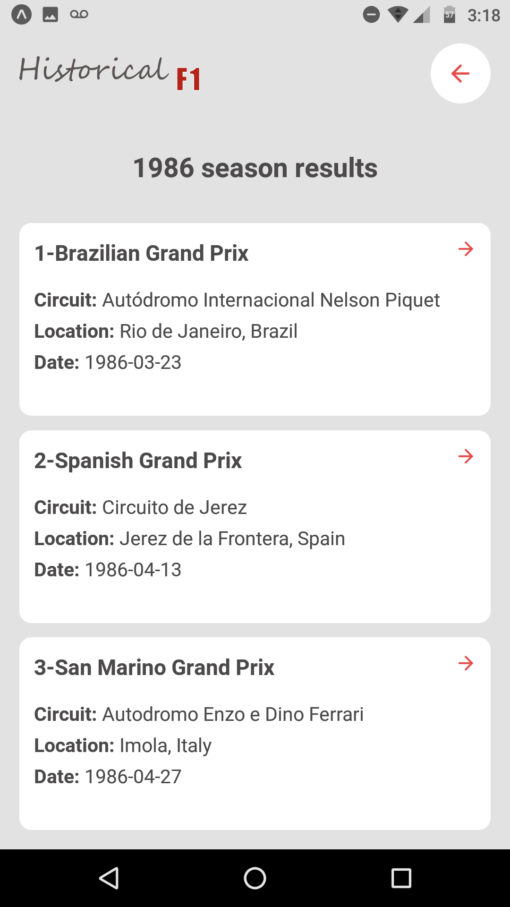
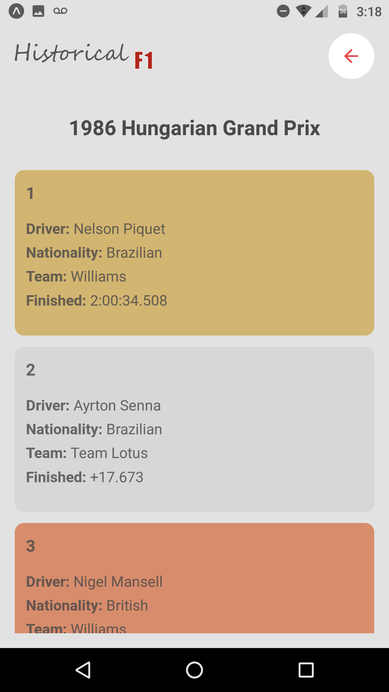

<h1 align="center" style="color: #E54A4A;">🏁 Historical F1 🏎</h1>

<h3 style="color: #E54A4A;">
    Historical F1 is an app that provides seasons and rounds data from any Formula 1 season, from 1950 to its current season!
</h3>

    Developed with React Native and Expo CLI, Historical F1 is an informative app fed by <a href="http://ergast.com/mrd/">Ergast Developer API</a>. The goal of this application was to practice and master all the React content I've been studying throughout 2020, specially since the beginning of the quarantine.

<h4>🛠 Tools and technologies 🛠</h4>
<ul>
    <li>React Native</li>
    <li>Expo CLI</li>
    <li>Axios</li>
    <li>TypeScript</li>
</ul>

<h4>🤔 What have I learned? 🤓</h3>

    Firstly, it is impossible not to talk about TypeScript and its importance. Many might think it affects the productivity at the beginning of the project, and that is true, since you obviously are going to create new data structures that the TypeScript will not be able to understand until you create an interface. But, as you keep going, TypeScript will help you a lot with auto complete features of your code editor, which avoid many mistakes you may commit without actually noticing. And last but not least, TypeScript is very important for other developers working on the same project, because they get to know what type of parameters functions will receive, which one of them are optional and the type of returning values as well.

    Secondly, I also figured how important it is to have project and code standards, write code as clean as possible and to organize your files, assets and components in folders and subfolders with suggestive names. This is very important, because as your project gets bigger, it will not be difficult to understand it and locate resources. In addition, it will improve the scalability of your code, being much easier to apply changes and implement new features, since it will not require many modifications on your code.

<h4>📷 Screenshots: 📷</h4>
<table>
    <tr>
        <td>
            
        </td>
        <td>
            
        </td>
        <td>
            
        </td>
    </tr>
</table>